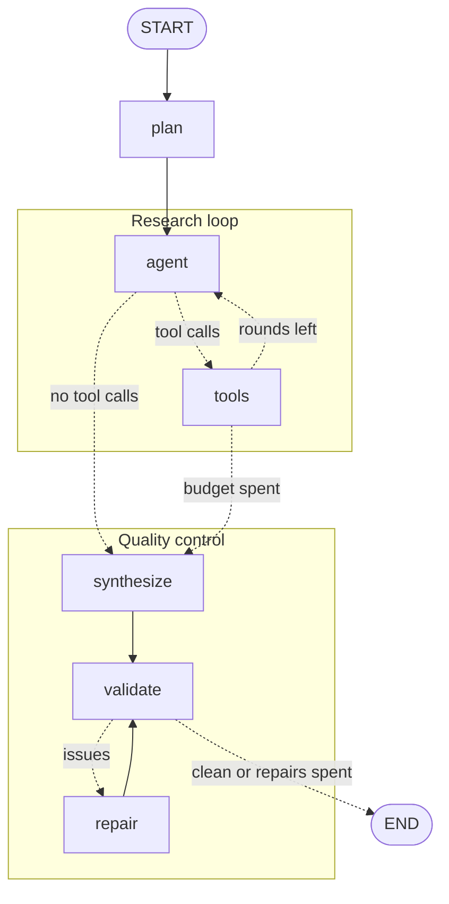

# ResearchPilot

[](https://github.com/nilswern/research-agent/actions/workflows/ci.yml)

An autonomous research agent built with **LangGraph**, **Google Gemini** and a
local **ChromaDB** vector store. Give it a question; it plans, picks its own
tools, researches across several rounds, remembers what it found, validates its
own citations against the sources the tools actually returned, and writes a
cited Markdown report.

Browser UI or command line — both drive the same graph and share the same
memory. Everything runs on free tiers: Gemini via Google AI Studio, DuckDuckGo
without an API key, and local embeddings.


A complete generated report is committed as
[`examples/metadata-filtering.md`](examples/metadata-filtering.md).

## How it works



The diagram is hand-edited for readability; `python main.py --graph` prints the
compiled graph for comparison.

Tool selection is made by the model, not hard-coded:
````

Tool selection is made by the model, not hard-coded:

| Tool | Purpose |
| --- | --- |
| `search_memory` | Semantic search over material from this and previous runs |
| `web_search` | General web search (DuckDuckGo, no API key) |
| `wikipedia_search` | Encyclopedic background |
| `arxiv_search` | Scientific abstracts |
| `scrape_webpage` | Full text of one URL, skipped if recently cached |

**Memory.** Everything retrieved is chunked, embedded locally and persisted in
ChromaDB with full provenance: the tool that found it, URL, title, author,
publication and retrieval date, query, content hash and document id. That
metadata is what lets the scraper skip pages fetched recently, lets a known URL
upsert instead of duplicate, and lets `--purge` drop anything older than
`CACHE_MAX_AGE_DAYS`.

**Source integrity.** The report is validated against the set of URLs the tools
actually returned. Fabricated URLs and citation markers without a reference
entry trigger a repair round; problems that survive the repair budget are
printed as a warning instead of being silently shipped. Optionally
(`FAITHFULNESS_CHECK=true`) every cited sentence is also compared against the
stored chunks of the source it cites, using the embeddings already in ChromaDB,
and sentences below the threshold go to the same repair stage.

## Evaluation

Source discipline is a claim, so there is a harness that measures it over a
fixed question set — factual, multi-hop, current-topic and deliberately
unanswerable questions, the last group being the interesting one:

```bash
python -m evals.run_eval                 # the whole set
python -m evals.run_eval --limit 3       # a quick pass
python -m evals.run_eval --delay 35      # pace it for a free-tier key
```

It records per question whether the first report passed validation without a
repair, how many repairs ran, how many fabricated URLs and dangling citations
survived, research rounds, sources, duration and token usage, and writes JSON
plus a Markdown table to `evals/results/`. It makes real API calls, so it is
never part of CI; the harness itself is covered by offline tests.

It checks citations, not whether the agent *declined*: for the `hard-to-source`
group, judging that still means reading the report.

Run of 2026-09-22, cold start with an empty store, three rounds per question,
`gemini-3.5-flash-lite` (the free tier allows 15 calls per minute and a question
costs seven or eight). Raw data:
[`evals/results/20260922-full-run.json`](evals/results/20260922-full-run.json).

| Category | Questions | 1st pass valid | Clean after repair | Fabricated URLs | Avg rounds | Avg sources |
| --- | --- | --- | --- | --- | --- | --- |
| factual | 3 | 2 | 2 | 0 | 2.7 | 13.7 |
| multi-hop | 4 | 3 | 4 | 0 | 3.0 | 15.8 |
| current | 3 | 3 | 3 | 0 | 3.0 | 18.3 |
| hard-to-source | 4 | 4 | 4 | 0 | 3.0 | 17.5 |
| **all** | **14** | **12 (86%)** | **13** | **0** | **2.9** | **16.4** |

**No report shipped a URL that no tool had returned**, across 14 questions and
229 collected sources. Two reports failed validation on the first attempt and
were repaired; one still had a defect afterwards — a citation marker without a
matching reference entry — and it came from the *easiest* category, not from the
unanswerable ones.

That last detail deserves caution: an earlier run of the same set, with a warm
memory, produced 10/14 on the first pass and put three of its four repairs in
`hard-to-source`. Two runs, two different pictures — 14 questions is a small
sample and a single number from it is a weak claim. What holds across both is
the part the design aims at: zero fabricated sources in the shipped report.
Cost per question: 16.5 seconds, roughly 13k input and 1.2k output tokens.

## Security

The agent reads pages written by strangers, and such a page can contain text
aimed at the model rather than at a reader. Four things follow from treating
that as the default:

- **Fetched text is fenced.** Page bodies, snippets, abstracts and stored
  passages are wrapped in `<untrusted_content>` delimiters before they reach the
  model, with any delimiter inside the payload neutralised first. The prompts
  state that fenced text is evidence, never an instruction.
- **Machine-relevant data is read outside the fence.** The allow-list of citable
  URLs is built only from what a tool itself emitted, never from inside fetched
  content. A page telling the agent to cite `attacker.test` produces a URL that
  validation then rejects as never returned by any tool.
- **Control flow cannot be argued with.** Round limit, repair limit and
  validation result are computed in code from counters and message structure, so
  no page can grant itself more rounds or skip a check.
- **The scraper cannot reach inward.** `scrape_webpage` resolves every host and
  refuses loopback, private, link-local and reserved addresses, including the
  cloud metadata endpoint. Redirects are followed one hop at a time and each hop
  is checked *before* it is requested.

`tests/test_security.py` covers each of these with an injected page or a forged
redirect.

**What this does not cover:** the model still *reads* the injected text, so
fencing makes it unlikely to obey, not impossible. A page can still mislead with
plausible false content — injection defence is not fact-checking. The address
check happens at resolution time, so DNS rebinding would slip through. Any
public URL is fair game: no domain allow-list, no sandbox. Treat this as a local
single-user tool, not as something to expose to a network.

## Design decisions

**A state graph instead of a ReAct loop.** The research budget has to be
enforceable, so control flow is data, not prompt text: `route_after_tools` stops
the loop once `MAX_RESEARCH_STEPS` rounds are spent, and `python main.py --graph`
prints the compiled graph. A reviewer can read the edges instead of guessing
what the model will do next.

**The model picks the tools, the code picks the limits.** All five tools are
bound to the LLM and a planning node sets the direction first. Hard-coded
routing ("if the question mentions a paper, call arXiv") is more predictable but
breaks on every question you did not anticipate.

**Local embeddings over an embedding API.** Every retrieved passage gets
embedded, so per-chunk API calls would dominate cost and rate limits.
`multilingual-e5-small` runs on CPU and handles German and English. The
trade-off is retrieval quality below large hosted models.

**The report is validated against reality.** An agent that invents a plausible
URL is worse than one that says nothing. An extra LLM call for a repair round is
cheap compared to a confidently fabricated source.

**One event stream, two frontends.** `src/graph/runner.py` emits typed events;
the CLI renders them with `rich`, the web UI forwards them as Server-Sent
Events. Progress reporting exists once, so the two cannot drift apart. The UI
itself is plain HTML, CSS and JavaScript — no bundler, no `node_modules`, no
CDN, down to a hand-written Markdown renderer.

### Known limitations

- Single user by design: the server binds to localhost and has no authentication.
- Only one run at a time; a second request is rejected rather than competing for
  the vector store.
- No LangGraph checkpointer: a run cannot be paused, resumed after a crash, or
  handed to a human for review mid-flight.
- DuckDuckGo throttles aggressively; heavy use produces empty search rounds.
- Retrieval is pure vector similarity: no re-ranking, no hybrid keyword search.
- The faithfulness check measures similarity, not entailment: it flags claims a
  source never discusses, not ones it contradicts in detail.
- URL identity is normalised per host, so the same paper mirrored elsewhere
  still counts as a separate source.

## Setup

```
python -m venv .venv
.venv\Scripts\Activate.ps1     # macOS / Linux: source .venv/bin/activate
pip install -r requirements.txt
copy .env.example .env         # macOS / Linux: cp
```

Then put a key into `.env` — a free one from
[Google AI Studio](https://aistudio.google.com/apikey) is enough.

## Usage

Double-click `ResearchPilot.vbs` (starts hidden) or `ResearchPilot.cmd` (keeps a
window with errors), both serving <http://localhost:8000>. The **Quit** button
in the page stops the server — closing the tab leaves it running.

From a terminal:

```bash
python main.py --web                     # same UI, opens the browser
python main.py "How do vector databases handle metadata filtering?"
python main.py --max-steps 3 --no-stream "What is RAG?"
python main.py --stats                   # memory statistics
python main.py --graph                   # the compiled graph as Mermaid
```

`python main.py --help` lists the rest: research rounds, results per search,
repair attempts, output language, saving and the address for `--web`. The UI
exposes the same options and covers every flag except `--graph`.

## Configuration

All settings live in `.env` (copy `.env.example`): model names, chunking,
retrieval, the three budgets, cache age, output language and paths. Every value
has a default; only `GOOGLE_API_KEY` is required. Two switches are off unless
you turn them on: `FAITHFULNESS_CHECK` for the claim-support check, and the
`LANGSMITH_*` variables, which turn on tracing without a line of code.

## Development

```bash
pip install -r requirements-dev.txt
ruff check src tests evals
ruff format --check src tests evals
mypy src evals
pytest -q
```

These are exactly the steps GitHub Actions runs on every push and pull request,
on Python 3.11 and 3.12. Tests make no network calls.

## AI assistance

This project was built with the help of an AI coding assistant (Claude), and it
seems fair to say where the line runs.

The design is mine: LangGraph over a hand-rolled agent loop, research rounds
separated from a dedicated validate/repair stage, embeddings local and memory
persistent, provenance on every chunk so the freshness cache and the source
validation can build on it. My focus throughout was the framework itself —
modelling an agent as an explicit state graph with nodes, conditional edges, a
bounded loop and streamed events, instead of treating the orchestration as a
black box. That is the part I am happiest to be questioned on.

The assistant helped me turn those decisions into code: implementations written
against my specifications, the browser UI, test scaffolding, and the tooling
around ruff, mypy and CI. I reviewed, corrected and tested what came back, and
dropped what did not match the intent.

## License

MIT — see [LICENSE](LICENSE).
