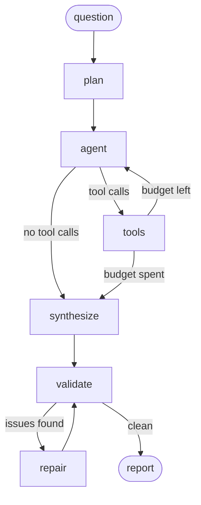

# ResearchPilot

[](https://github.com/nilswern/research-agent/actions/workflows/ci.yml)

An autonomous research agent built with **LangGraph**, **Google Gemini** and a local
**ChromaDB** vector store. Give it a question; it plans, decides which tools to use,
researches across several rounds, remembers what it found, validates its own
citations, and writes a cited Markdown report.

Use it from a local browser UI or from the command line — both drive the same
graph and share the same memory.

Everything runs on free tiers: Gemini via Google AI Studio, DuckDuckGo without an
API key, and local embeddings — no per-chunk API calls.

## Architecture



Regenerate the exact compiled graph with `python main.py --graph`.

Tool selection is made by the model, not hard-coded:

| Tool | Purpose |
| --- | --- |
| `search_memory` | Semantic search over material from this and previous runs |
| `google_search` | General web search (DuckDuckGo, no API key) |
| `wikipedia_search` | Encyclopedic background |
| `arxiv_search` | Scientific abstracts |
| `scrape_webpage` | Full text of one URL, skipped if recently cached |

### Memory

Everything retrieved is chunked, embedded locally and persisted in ChromaDB with
full provenance: `source_tool`, `url`, `title`, `author`, `published_date`,
`retrieved_at`, `query`, `chunk_index`, `content_hash`, `document_id`,
`content_type`, `language`. Chunks older than `CACHE_MAX_AGE_DAYS` count as stale;
`--purge` removes them. Re-indexing a known URL upserts instead of duplicating.

### Source integrity

The report is validated against the set of URLs the tools actually returned.
Fabricated URLs and citation markers without a reference entry trigger a repair
round. If problems survive the repair budget, they are printed as a warning instead
of being silently shipped.

A real URL is not the same as a supporting one, so there is a second, optional
check: with `FAITHFULNESS_CHECK=true`, every sentence carrying a citation is
compared against the stored chunks of exactly the source it cites, using the
embeddings already in ChromaDB. Sentences below `FAITHFULNESS_THRESHOLD` are
reported as unsupported claims and go to the same repair stage. It is off by
default because it costs one vector query per cited sentence, and it is a
similarity proxy: it catches a claim the source never discusses, not a subtly
wrong number.

## Design decisions

**A state graph instead of a ReAct loop.** The research budget has to be
enforceable, so the control flow is data, not prompt text: `route_after_tools`
stops the loop once `MAX_RESEARCH_STEPS` rounds are spent, the recursion limit is
derived from the budgets, and `python main.py --graph` prints the compiled graph.
Anyone reviewing the agent can read the edges instead of guessing what the model
will do next.

**The model picks the tools, the code picks the limits.** All five tools are
bound to the LLM and selection happens per question, preceded by a planning node
that sets the direction. Hard-coded routing ("if the question mentions a paper,
call arXiv") is more predictable but breaks on every question you did not
anticipate. The budget, not a rule set, is what keeps runs bounded.

**Local embeddings over an embedding API.** Every retrieved passage gets embedded,
so a per-chunk API call would dominate both cost and rate limits.
`multilingual-e5-small` runs on CPU, handles German and English questions, and
makes the memory usable without a network round trip. The trade-off is retrieval
quality below large hosted models and a one-time model download.

**Provenance on every chunk, not just the text.** Each chunk carries `url`,
`document_id`, `content_hash`, `retrieved_at` and the tool that found it. That
single decision buys three features: re-indexing a known URL upserts instead of
duplicating (`document_id` is the URL hash), the scraper can skip pages fetched
recently, and stale material can be purged by age.

**The report is validated against reality.** A research agent that invents a
plausible URL is worse than one that says nothing, so the report is checked
against the set of URLs the tools actually returned; fabricated links and
citation markers without a reference entry trigger a repair round. Surviving
issues are shown as a warning rather than silently shipped — an extra LLM call is
cheap compared to a confidently fabricated source.

**One event stream, two frontends.** `src/graph/runner.py` emits typed events
(`plan`, `status`, `token`, `report`, `final`); the CLI renders them with `rich`,
the web UI forwards them as Server-Sent Events. Progress reporting exists once,
so the two interfaces cannot drift apart.

**A UI with no build step.** The page is plain HTML, CSS and JavaScript served by
FastAPI — no bundler, no `node_modules`, no CDN, including a small hand-written
Markdown renderer. Cloning the repo and running one command has to be enough;
a frontend toolchain would be a second project to maintain.

**One run at a time.** The vector store is a single local process, so the server
rejects a second concurrent research instead of pretending to scale. Honest
limits beat corrupted state.

**Fetched text is data, not instruction.** A research agent reads pages written
by strangers, so every fetched passage is fenced in `<untrusted_content>` markers
that the prompts declare to be evidence only, and the graph reads URLs for the
allow-list from the tool's own output rather than from the page body. The agent
cannot be talked into citing an attacker's URL by a paragraph inside a page it
scraped. See [Security](#security) for what this does and does not cover.

### Known limitations

- Single user by design: the server binds to localhost and has no authentication.
- DuckDuckGo throttles aggressively; heavy use produces empty search rounds.
- Cancelling a run stops it at the next event — an LLM or tool call already in
  flight still finishes.
- Retrieval is pure vector similarity: no re-ranking, no hybrid keyword search.
- The faithfulness check measures similarity, not entailment: it flags claims a
  source never discusses, not ones it contradicts in detail.
- The Markdown renderer covers what the reports use, not the full spec.

## Setup

```powershell
# Windows
python -m venv .venv; .venv\Scripts\Activate.ps1
pip install -r requirements.txt
copy .env.example .env   # set GOOGLE_API_KEY from https://aistudio.google.com/apikey
```

```bash
# macOS / Linux
python -m venv .venv && source .venv/bin/activate
pip install -r requirements.txt
cp .env.example .env
```

## Usage

The browser UI and the CLI do the same work — same graph, same memory, same
reports. Pick whichever you prefer.

### Browser UI

Without a terminal, double-click one of the launchers in the project root:

| Launcher | Behaviour |
| --- | --- |
| `ResearchPilot.vbs` | Starts hidden in the background, opens the browser |
| `ResearchPilot.cmd` | Same, but keeps a window that shows errors |

Both serve <http://localhost:8000>. Stop the server with the **Quit** button
in the top right of the page — closing the browser tab leaves it running.

From a terminal:

```bash
python main.py --web                        # opens the browser on port 8000
python main.py --web --port 8080 --no-browser
```

The page is served by a local FastAPI app: type a question and watch the plan,
the tool rounds and the validation appear live while the report streams in token
by token, then gets rendered as Markdown. Sources, unresolved validation issues
and the name of the saved file sit next to it, and earlier reports from
`reports/` can be reopened from the sidebar. The options panel sets the same
knobs as the CLI flags: rounds, results per search, repair attempts, language and
whether to save.

Only one run executes at a time; a second request is rejected with a clear
message instead of competing for the vector store. Nothing leaves the machine
except the calls the agent makes itself.

| Endpoint | Purpose |
| --- | --- |
| `GET /` | The UI itself |
| `POST /api/research` | Run a research, streamed as Server-Sent Events |
| `GET /api/stats` | Memory statistics and default settings |
| `GET /api/reports` · `GET /api/reports/{name}` | List and read saved reports |
| `POST /api/purge` | Delete stale chunks |
| `POST /api/shutdown` | Stop the server (what the *Quit* button calls) |

The UI covers every CLI flag except `--graph`, the Mermaid export for developers.

### CLI

```bash
python main.py "How do vector databases handle metadata filtering?"
python main.py "What is RAG?" --max-steps 3 --no-stream
python main.py --stats
python main.py --graph
```

| Flag | Effect |
| --- | --- |
| `--max-steps N` | Override research rounds |
| `--results N` | Results per search |
| `--repairs N` | Report repair attempts |
| `--language en\|de` | Report language |
| `--no-stream` | Render the report at once instead of streaming |
| `--no-save` | Skip writing to `reports/` |
| `--purge` | Delete stale chunks first |
| `--stats` | Show memory statistics and exit |
| `--graph` | Print the compiled graph as Mermaid and exit |
| `--verbose` | Show agent logs |
| `--web` | Start the browser UI instead of a single run |
| `--host` · `--port` | Address for `--web` (default `127.0.0.1:8000`) |
| `--no-browser` | Do not open a browser tab with `--web` |

## Example run

```bash
python main.py "How do vector databases handle metadata filtering?" --max-steps 3
```

The terminal shows the run as it happens:

```
╭─ Question ───────────────────────────────────────────╮
│ How do vector databases handle metadata filtering?   │
╰──────────────────────────────────────────────────────╯
Plan created
╭─ Research plan ──────────────────────────────────────╮
│ 1. Check memory for prior material on filtering      │
│ 2. Search for pre- vs post-filtering trade-offs      │
│ 3. Read one primary source in full                   │
╰──────────────────────────────────────────────────────╯
→ search_memory
  Round 1 · 0 sources
→ google_search, wikipedia_search
  Round 2 · 7 sources
→ scrape_webpage
  Round 3 · 9 sources
Writing the report
──────────────────── Report ───────────────────────────
# Metadata filtering in vector databases
## Summary
...
Validation passed

Saved: reports/20260922-104233_how-do-vector-databases-handle-met.md
3 rounds · 9 sources · 0 repairs · 142 chunks in memory
```

A full generated report from that command, including its frontmatter and
reference list, is committed as
[`examples/metadata-filtering.md`](examples/metadata-filtering.md).

## Evaluation

Source discipline is a claim, so there is a harness that measures it. It runs
the agent over a fixed question set and records what actually happened:

```bash
python -m evals.run_eval              # the whole set
python -m evals.run_eval --limit 3    # a quick pass
python -m evals.run_eval --category hard-to-source
```

The question set in [`evals/questions.jsonl`](evals/questions.jsonl) has four
kinds of question, and the last kind is the interesting one:

| Category | What it probes |
| --- | --- |
| `factual` | One well-documented answer. The baseline. |
| `multi-hop` | Two or three sub-questions that need different sources. |
| `current` | Moving targets where the training data is wrong by now. |
| `hard-to-source` | Questions with no trustworthy answer, including one that is unanswerable by construction. Declining is the correct behaviour. |

Per question it records whether the first report passed validation without a
repair, how many repairs ran, how many fabricated URLs and dangling citations
survived, unsupported claims when the faithfulness check is on, research rounds,
sources, duration and token usage. Results are written to `evals/results/` as
JSON plus a Markdown table.

This makes real API calls, so it is never part of CI. The harness itself is
covered by offline tests using a fake model.

### Results

Run of 2026-09-22 with `gemini-3.5-flash-lite`, three research rounds per
question, faithfulness check off, memory pre-seeded with 18 chunks from earlier
runs. Raw data: [`evals/results/20260922-full-run.json`](evals/results/20260922-full-run.json).

| Category | Questions | 1st pass valid | Clean after repair | Fabricated URLs | Avg rounds | Avg sources |
| --- | --- | --- | --- | --- | --- | --- |
| factual | 3 | 2 | 3 | 0 | 3.0 | 11.0 |
| multi-hop | 4 | 4 | 4 | 0 | 3.0 | 19.3 |
| current | 3 | 3 | 3 | 0 | 3.0 | 15.0 |
| hard-to-source | 4 | 1 | 3 | 0 | 2.8 | 16.5 |
| **all** | **14** | **10 (71%)** | **13** | **0** | **2.9** | **15.8** |

The bottom body row is the one worth reading. Questions with a documented answer
were right on the first attempt; the questions with no trustworthy answer
produced three of the four repairs, and the single report that still had a defect
after repair - a citation marker without a matching reference entry - came from
that group too. No report shipped a fabricated URL.

That is the validation stage earning its cost exactly where it was meant to:
the agent is least reliable when the honest answer is "this cannot be
established", which is also when a plausible-looking invented source would do
the most damage.

Cost per question: 17s, roughly 6.7k input and 160 output tokens. One question
hit the free tier's per-minute limit mid-run; the harness recorded it as a
failed measurement instead of crashing, and it was rerun afterwards.

## Security

The agent reads web pages, and a web page can contain text aimed at the model
rather than at a reader. Three things follow from treating that as the default:

**Fetched text is fenced.** Page bodies, snippets, abstracts and stored passages
are wrapped in `<untrusted_content>` delimiters before they reach the model, with
any delimiter inside the payload neutralised first. The research and synthesis
prompts state that fenced text is evidence and never an instruction.

**Machine-relevant data is read outside the fence.** The allow-list of citable
URLs is built only from what a tool itself emitted - the URL it fetched, the URLs
a search API returned - never from inside fetched content. A page telling the
agent to cite `attacker.test` produces a URL the validation stage then rejects as
never returned by any tool.

**Control flow cannot be argued with.** Budgets and routing read counters and
message structure, not text: the round limit, the repair limit and the
validation result are computed in code, so no page can grant itself more rounds
or skip a check. Titles and author names are flattened to a single short line.

`tests/test_security.py` covers each of these with an injected page.

### What this does not cover

- The model still *reads* the injected text. Fencing makes it unlikely to obey,
  not impossible; no prompt-level defence is a guarantee.
- A page can still mislead the agent with plausible false *content*. Injection
  defence is not fact-checking - that is what validation and the faithfulness
  check are for, and both have limits.
- Tools run with the process's own network access. There is no sandbox, no
  allow-list of domains, and `scrape_webpage` will fetch any URL the model asks
  for, including internal addresses if the machine can reach them.
- Nothing is rate-limited or quota-guarded beyond the research budget.

Treat this as a local single-user tool, not as something to expose to a network.

## Observability

Tracing is wired through environment variables only, so nothing is imported,
nothing costs anything and CI needs no keys:

```bash
LANGSMITH_TRACING=true
LANGSMITH_API_KEY=<your key>
LANGSMITH_PROJECT=researchpilot
```

LangChain picks these up by itself, and every node, tool call and model call of
a run shows up as one trace - useful for seeing which round burned the budget.
Unset, the agent runs exactly as before.

<!-- Add a trace screenshot as docs/trace.png and uncomment the next line. -->
<!--  -->

## Configuration

All settings live in `.env` (copy `.env.example`): model names, `CHUNK_SIZE`,
`RETRIEVAL_TOP_K`, `MAX_RESEARCH_STEPS`, `MAX_RESULTS_PER_SEARCH`,
`MAX_REPORT_REPAIRS`, `CACHE_MAX_AGE_DAYS`, output language and paths. Every
value has a default; only `GOOGLE_API_KEY` is required.

Two optional switches are off unless you turn them on: `FAITHFULNESS_CHECK`
(plus `FAITHFULNESS_THRESHOLD`) adds the claim-support check described under
[Source integrity](#source-integrity), and the `LANGSMITH_*` variables enable
[tracing](#observability).

## Project layout

```
main.py                 entry point
ResearchPilot.vbs/.cmd  double-click launchers for the browser UI
src/
├── agent/              prompts
├── graph/              state, nodes, builder, mermaid export, run event stream
├── tools/              the five LLM tools
├── database/           ChromaDB layer and store factory
├── services/           llm, embeddings, chunking, scraper, reporting, validation,
│                       faithfulness, untrusted-content fencing
├── models/             Pydantic data models
├── config/             settings, logging
├── web/                FastAPI app, uvicorn launcher, static UI
└── cli.py
evals/                  question set and the measurement harness
tests/                  unit tests, no network calls
examples/               a generated report to look at
docs/                   screenshots for the README
reports/                generated Markdown reports
data/chroma/            the vector store
```

Both frontends consume the same event stream from `src/graph/runner.py`, so the
CLI and the UI always report the same progress.

## Development

```bash
pip install -r requirements-dev.txt
ruff check src tests evals
ruff format --check src tests evals
mypy src evals
pytest -q
```

These are exactly the steps GitHub Actions runs on every push and pull request
(`.github/workflows/ci.yml`, on Python 3.11 and 3.12). Tool settings — line
length, lint rules, mypy strictness, pytest paths — live in `pyproject.toml`.

## AI assistance

This project was built with the help of an AI coding assistant (Claude), and it
seems fair to say where the line runs.

The design is mine. Choosing LangGraph over a hand-rolled agent loop, separating
the research rounds from a dedicated validate/repair stage, keeping embeddings
local and the memory persistent, and attaching provenance to every chunk so that
the freshness cache and the source validation can build on it — those decisions,
and the trade-offs behind them in [Design decisions](#design-decisions), came
first and shaped everything else.

My focus throughout was the framework itself: learning to model an agent in
LangGraph as an explicit state graph — nodes, conditional edges, a bounded
research loop, a separate repair stage and streamed events — instead of treating
the orchestration as a black box. That is the part of this project I care about
most, and the part I am happiest to be questioned on.

The assistant helped me turn them into code: implementations written against my
specifications, the browser UI, test scaffolding, and the tooling setup around
ruff, mypy and CI. I reviewed, corrected and tested what came back, and dropped
what did not match the intent. 